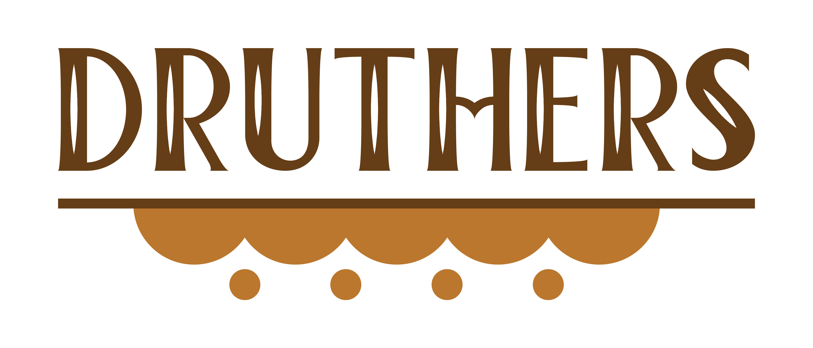

**Druthers**: an old-timey way to say preferences

> _Iffen I had my druthers I'd choose this here multi-select_


Artwork courtesy of [Rebecca Brenneman](https://www.linkedin.com/in/rebecca-brenneman-7217b825)

# Demo with Storybook

https://brennemankyle.github.io/druthers/

# Features

A robust multi-select that automatically uses Radios, Checkboxes, or a Switch if they'll fit on one line

- Deterministic even with dynamic/live prop updates
- Completely customizable: replace any internal component, styling, icon, text, or search filter by changing props
- Automatically uses Radios, Checkboxes, or a Switch if it fits on one line (updates on live screen resizes)
- Search using fuzzy matching: mossisippi > Mississippi, py > Pi. Powered by https://glench.github.io/fuzzyset.js/
- Fully usable with only the Keyboard
- Creatable options (managed by a prop not a separate component)
- Infinite nestable Option Groups and parents are seletable
- Small npm package size
- No Jquery
- Modern browser support: Chrome, Safari, Edge, Firefox, iOS, Android
- And much more!

# Install

`npm install druthers`

```javascript
// Example File
import React, { useState } from "react";
import Druthers from "druthers";

// With React Function/Hooks
let SomeHook = () => {
  const [selection, setSelection] = useState();
  let options = [
    { value: "1", label: "Option 1" },
    { value: "2", label: "Option 2" }
  ];

  return (
    <Druthers
      name="example"
      selection={selection}
      onChange={e => setSelection(e.target.value)}
      options={options}
    />
  );
};

// OR With React Component
class SomeComponent extends React.Component {
  constructor(props) {
    super(props);
    this.state = { selection };
    this.options = [
      { value: "1", label: "Option 1" },
      { value: "2", label: "Option 2" }
    ];
  }

  onChange(e) {
    this.setState({
      selection: e.target.value
    });
  }

  render() {
    return (
      <Druthers
        name="example"
        selection={this.state.selection}
        onChange={this.onChange}
        options={this.options}
      />
    );
  }
}
```

# Comparison

| Name                      | Bundle Size                                                  |
| ------------------------- | ------------------------------------------------------------ |
| druthers                  | gzip 21.1kB (https://bundlephobia.com/result?p=druthers)     |
| react-select (competitor) | gzip 26.1kb (https://bundlephobia.com/result?p=react-select) |

# Property Defaults

| Name                                       | Default Value                    |
| ------------------------------------------ | -------------------------------- |
| onChange                                   | undefined                        |
| onBlur                                     | noop                             |
| onFocus                                    | noop                             |
| name                                       | undefined                        |
| selection                                  | []                               |
| options                                    | []                               |
| placeholder                                | 'Select...'                      |
| multiple                                   | false                            |
| disabled                                   | false                            |
| creatable                                  | false                            |
| removable                                  | true                             |
| appendToBody                               | false                            |
| rightToLeft                                | false                            |
| allowDuplicates                            | true                             |
| alwaysReturnArray                          | false                            |
| optionsAlwaysOpen                          | false                            |
| overlayOptions                          | true                            |
| searchable                          | true                            |
| preventDisplayElementOptionClick | false                      |
| filterOptions                              | filterOptions                    |
| massageDataIn                              | massageDataIn                    |
| massageDataOut                             | massageDataOut                   |
| selectReducer                              | selectReducer                    |
| valueKey                                   | object => object["value"]        |
| labelKey                                   | object => object["label"]        |
| displayElementKey                                 | (item) => item["displayElement"]      |
| selectableKey                                 |  (item) => item["selectable"]      |
| optionsKey                                 | object => object["options"]      |
| checkRadioMaxCount                         | 10                               |
| truncateOptions                     | null                        |
| parseTo                                    | string                           |
| **Text Props**                             |                                  |
| text_placeholder                           | ''                               |
| text_noOptions                             | 'No Options'                     |
| text_truncatedShow             | Show:             |
| text_truncatedHide             | Hide:             |
| text_create                                | 'Create'                         |
| **Component Props**                        |                                  |
| component_Select                           | Select                           |
| component_CheckRadio                       | CheckRadio                       |
| component_CheckBox                         | CheckBox                         |
| component_Radio                            | Radio                            |
| component_Switch                           | Switch                           |
| component_HtmlFieldData                    | HtmlFieldData                    |
| component_Wrapper                          | Wrapper                          |
| component_Selection                        | Selection                        |
| component_SelectionList                    | SelectionList                    |
| component_OptionList                       | OptionList                       |
| component_Option                           | Option                           |
| component_Search                           | Search                           |
| component_SelectionWrapper                 | SelectionWrapper                 |
| component_OptionsWrapper                   | OptionsWrapper                   |
| component_AppendToBodyOptionsWrapper       | AppendToBodyOptionsWrapper       |
| component_StyledAppendToBodyOptionsWrapper | StyledAppendToBodyOptionsWrapper |
| **SVG Props**                              |                                  |
| svg_Checkmark                              | Checkmark                        |
| svg_Remove                                 | Remove                           |
| svg_Expand                                 | Expand                           |
| **Style Props**                            |                                  |
| styles_fontSize                            | '1em'                            |
| styles_borderRadius                        | '.2em'                           |
| styles_borderWidth                        | '1px'                           |
| styles_borderStyle                        | 'solid'                           |
| styles_paddingTop                          | '.25em'                          |
| styles_paddingBottom                       | '.25em'                          |
| styles_paddingLeft                         | '.25em'                          |
| styles_paddingRight                        | '.25em'                          |
| styles_selection_paddingTop                | '.2em'                           |
| styles_selection_paddingBottom             | '.2em'                           |
| styles_selection_paddingLeft               | '.4em'                           |
| styles_selection_paddingRight              | '.4em'                           |
| styles_selection_margin                    | '.2em'                           |
| styles_option_paddingTop                   | '.25em'                          |
| styles_option_paddingBottom                | '.25em'                          |
| styles_option_paddingLeft                  | '.25em'                          |
| styles_option_paddingRight                 | '.25em'                          |
| styles_checkRadio_borderWidth              | '2px'                            |
| styles_checkRadio_marginBetween            | '1em'                            |
| styles_checkRadio_labelMargin              | '.2em'                           |
| styles_checkRadio_paddingTop               | '.2em'                           |
| styles_checkRadio_paddingBottom            | '.2em'                           |
| styles_checkRadio_paddingLeft              | '.2em'                           |
| styles_checkRadio_paddingRight             | '.2em'                           |
| styles_search_size                         | 5                                |
| styles_icon_width                          | '1em'                            |
| styles_colors_primary                      | 'black'                          |
| styles_colors_secondary                    | '#C3C3C3'                        |
| styles_colors_highlight                    | 'lightblue'                      |
| styles_colors_warning                      | '#FABAAC'                        |
| styles_colors_warningBold                  | '#FA2222'                        |
| styles_colors_disabled                     | '#ECECEC'                        |
| styles_colors_background                   | 'white'                          |

# Property Descriptions

| Name                                       | Description                                                                     |
| ------------------------------------------ | ------------------------------------------------------------------------------- |
| onChange                                   | Event when selection changes                                                    |
| onBlur                                     | Event when focus is lost                                                        |
| onFocus                                    | Event when focus is gained                                                      |
| name                                       | The HTML name in the form                                                       |
| selection                                  | The currently selected items                                                    |
| options                                    | The options to choose from                                                      |
| placeholder                                | The placeholder of the search field                                             |
| multiple                                   | Whether multiple items can be selected                                          |
| disabled                                   | Whether component is disabled                                                   |
| creatable                                  | Whether new selected items can be created                                       |
| removable                                  | Whether selected items are removable                                            |
| appendToBody                               | Whether options append to the body tag (can prevent options from being clipped) |
| rightToLeft                                | Whether to show text from right to left instead                                 |
| allowDuplicates                            | Whether duplicate selection items are allowed                                   |
| alwaysReturnArray                          | Always return an array from onChange, instead of only when multiple             |
| optionsAlwaysOpen                          | Sets whether the option list is always open                            |
| overlayOptions                          | Overlay the options on top of other elements. Usually used in conjunction with optionsAlwaysOpen to have the list always open and displayed inline in a list                             |
| searchable                          | Whether the options are searchable                            |
| preventDisplayElementOptionClick | Prevent child display element from doing it's default click                      |
| filterOptions                              | The function which filters options based on search text                         |
| massageDataIn                              | The function that massages the props coming in                                  |
| massageDataOut                             | The function massaging the selection returned from the onChange event           |
| selectReducer                              | The function/reducer that controls the state of the Select component            |
| valueKey                                   | The name of the value key in an option object, can be a function or string      |
| labelKey                                   | The name of the label key in an option object, can be a function or string      |
| displayElementKey                                 | The name of the element to display, if there is one     |
| selectableKey                                 |  The key for if an option is selectable      |
| optionsKey                                 | The name of the child options key in an option object, function or string       |
| checkRadioMaxCount                         | The maximum radio buttons allowed before rendering a Select instead             |
| truncateOptions                               | The amount of options to show, the rest will be truncated                 |
| parseTo                                    | parse value from onChange to a js type: string, number, int, float, boolean     |
| **Text Props**                             |                                                                                 |
| text_placeholder                           | Same as `placeholder` with a more descriptive name                              |
| text_noOptions                             | The text shown when there are no options                                        |
| text_truncatedShow             | The text shown when options have been truncated             |
| text_truncatedShow             | The text shown when options have been truncated but they are shown            |
| text_create                                | The text shown when a new selection can be created                              |
| **Component Props**                        |                                                                                 |
| component_Select                           | Multi/Single select component                                                   |
| component_CheckRadio                       | Groups checkbox and radio components                                            |
| component_CheckBox                         | Checkbox component                                                              |
| component_Radio                            | Radio button component                                                          |
| component_Switch                           | On/Off switch component                                                         |
| component_HtmlFieldData                    | Hidden component which keeps current selection in the HTML form                 |
| component_Wrapper                          | Wraps the entire select component                                               |
| component_Selection                        | Component showing one selected item                                             |
| component_SelectionList                    | List of selected items                                                          |
| component_OptionList                       | List of options                                                                 |
| component_Option                           | Component showing one option                                                    |
| component_Search                           | Component responsable for the search text                                       |
| component_SelectionWrapper                 | Displays everything for the Select except the options                           |
| component_OptionsWrapper                   | Wraps the OptionList                                                            |
| component_AppendToBodyOptionsWrapper       | Appends the OptionList to body tag                                              |
| component_StyledAppendToBodyOptionsWrapper | Styleable version of AppendToBodyOptionsWrapper wrapped inside of it            |
| **SVG Props**                              |                                                                                 |
| svg_Checkmark                              | The checkmark image                                                             |
| svg_Remove                                 | The remove image                                                                |
| svg_Expand                                 | the expand image                                                                |
| **Style Props**                            |                                                                                 |
| styles_fontSize                            | Controls the entire size of the component                                       |
| styles_borderRadius                        | The amount of curve of the border                                               |
| styles_borderWidth                        | The width of the border                                               |
| styles_borderStyle                        | The border style                                             |
| styles_paddingTop                          | The padding top                                                                 |
| styles_paddingBottom                       | The padding bottom                                                              |
| styles_paddingLeft                         | The padding left                                                                |
| styles_paddingRight                        | The padding right                                                               |
| styles_selection_paddingTop                | The selection's padding top                                                     |
| styles_selection_paddingBottom             | The selection's padding bottom                                                  |
| styles_selection_paddingLeft               | The selection's padding left                                                    |
| styles_selection_paddingRight              | The selection's padding right                                                   |
| styles_selection_margin                    | The selection's margin                                                          |
| styles_option_paddingTop                   | The option's padding top                                                        |
| styles_option_paddingBottom                | The option's padding bottom                                                     |
| styles_option_paddingLeft                  | The option's padding left                                                       |
| styles_option_paddingRight                 | The option's padding right                                                      |
| styles_checkRadio_borderWidth              | The border width for checkbox, radio, and switch                                |
| styles_checkRadio_marginBetween            | The margin between radios and checkboxes                                        |
| styles_checkRadio_labelMargin              | The margin between the label and it's radio/checkbox/switch                     |
| styles_checkRadio_paddingTop               | The padding top for radio/checkbox/switch group                                 |
| styles_checkRadio_paddingBottom            | The padding bottom for radio/checkbox/switch group                              |
| styles_checkRadio_paddingLeft              | The padding left for radio/checkbox/switch group                                |
| styles_checkRadio_paddingRight             | The padding right for radio/checkbox/switch group                               |
| styles_search_size                         | The size of the search component                                                |
| styles_icon_width                          | The width of all icon/SVGs                                                      |
| styles_colors_primary                      | The primary color used                                                          |
| styles_colors_secondary                    | The secondary color used                                                        |
| styles_colors_highlight                    | The color of a highlighted option                                               |
| styles_colors_warning                      | The color of remove selection background                                        |
| styles_colors_warningBold                  | The color of the remove selection icon                                          |
| styles_colors_disabled                     | The color for disabled elements                                                 |
| styles_colors_background                   | The background color used                                                       |

# Contributing

## Publishing updates to the npm packages

- Make code updates
- Increment the version in the package.json
- Run the typescript build `npm run tsc-build` to make sure it builds without error
- publish the npm package update `npm publish`